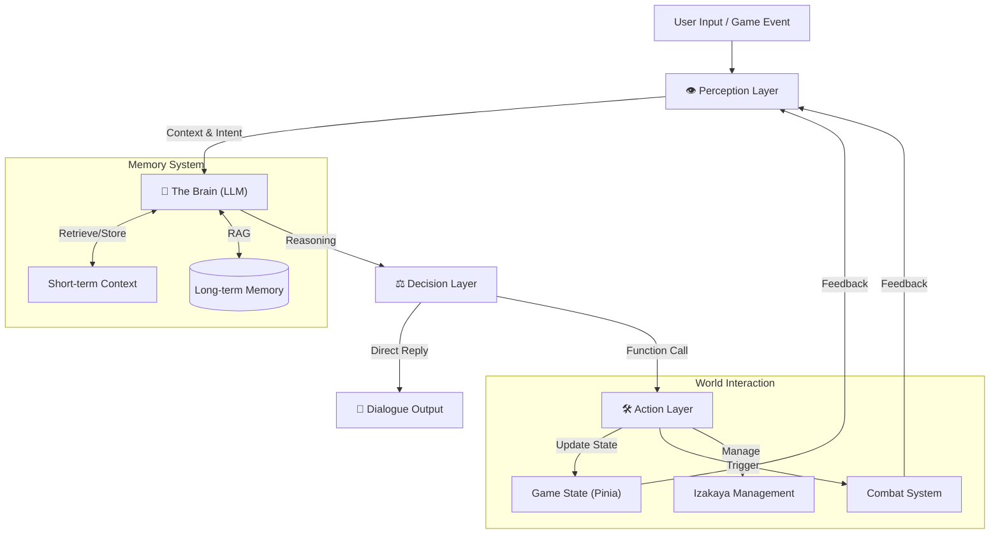
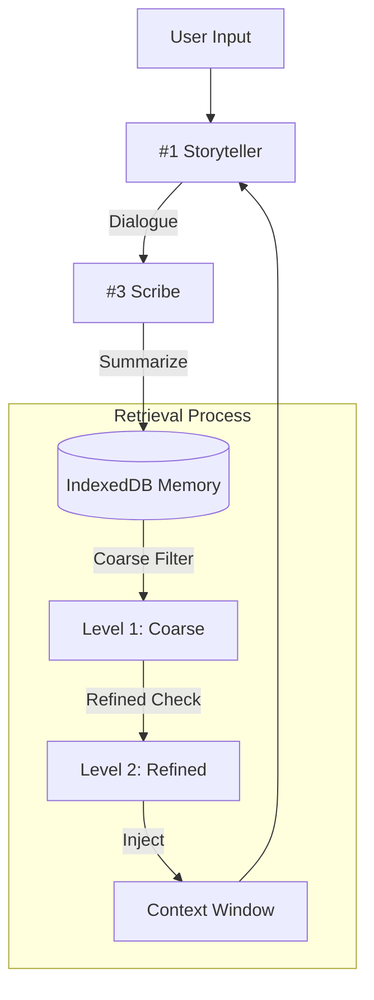

<div align="center">

<!-- 动态渐变头图 - 东方风格配色 -->


<br/>

<!-- 多行动态打字效果 -->
<a href="https://github.com/YoKONCy/touhou-isekai-izakaya">
  
</a>

<br/>

<a href="https://github.com/YoKONCy/touhou-isekai-izakaya">
  
</a>

<br/><br/>

<!-- 徽章导航 -->
<a href="./README.md">
  
</a>
&nbsp;
<a href="./LICENSE">
  
</a>
&nbsp;
<a href="./TECHNICAL_DESIGN.md">
  
</a>
&nbsp;
<a href="#-quick-start">
  
</a>

<br/><br/>

> **"Welcome to the boundary between fantasy and reality. What can I get for you today?"**

</div>

<!-- 动态分隔线 -->


<br/>

## 📋 Table of Contents

<details open>
<summary><b>Quick Navigation</b></summary>
<br/>

| Section | Description | Link |
|:-------:|:------------|:----:|
| 🎯 | **Overview** - 项目概述与核心特色 | [Jump](#-overview) |
| � | **AI Agent** - 智能体架构解析 | [Jump](#-ai-agent-architecture) |
| � | **Memory System** - 独特的长记忆机制 | [Jump](#-long-term-memory) |
| 🏗️ | **Architecture** - 系统架构与技术栈 | [Jump](#️-architecture) |
| ⚔️ | **Combat System** - 策略弹幕战斗 | [Jump](#-combat-system) |
| 🚀 | **Quick Start** - 快速开始指南 | [Jump](#-quick-start) |
| 🖼️ | **AI Drawing** - AI 绘图与隐私说明 | [Jump](#-ai-drawing-privacy) |
| 📅 | **Roadmap** - 开发计划与待办 | [Jump](#-roadmap) |
| ⚠️ | **Disclaimer** - 版权与声明 | [Jump](#-disclaimer) |

</details>

<br/>

<!-- 动态分隔线 -->


<br/>

## 🎯 Overview

<div align="center">


<br/><br/>

<!-- 项目核心亮点卡片 -->
<table>
<tr>
<td align="center" width="160">
<br/>
<b>无限叙事</b><br/>
<sub>Infinite Narrative</sub>
</td>
<td align="center" width="160">
<br/>
<b>四重奏架构</b><br/>
<sub>4-Model Collaboration</sub>
</td>
<td align="center" width="160">
<br/>
<b>长记忆系统</b><br/>
<sub>Scribe & Retrieval</sub>
</td>
<td align="center" width="160">
<br/>
<b>模拟经营</b><br/>
<sub>Izakaya Management</sub>
</td>
<td align="center" width="160">
<br/>
<b>策略战斗</b><br/>
<sub>Danmaku & Persuasion</sub>
</td>
</tr>
</table>

<br/>

<h3>🎮 <a href="https://yokoncy.github.io/Touhou-Isekai-Izakaya/">立即试玩 / Live Demo</a></h3>
<p>
  <b><a href="https://yokoncy.github.io/Touhou-Isekai-Izakaya/">👉 点击进入幻想乡 / Enter Gensokyo</a></b>
  <br/>
  <sub>⛩️ 东方异界食堂 beta 🍵 还没有任何对话... 点一杯茶，开始你的幻想乡物语吧。</sub>
</p>

### 🚧 Beta Version Notice / 测试版说明

当前游戏处于 **Beta 测试阶段**，功能仍在快速迭代中：
- **存档兼容性**: 随着版本更新，存档结构可能会发生变化（虽然我们会尽力保持兼容）。
- **LLM 稳定性**: 角色扮演与逻辑判断正在持续调优。
- **经营系统**: 居酒屋经营模块目前为实验性功能。
- **静态资源**: 部分图片与音频资源可能仍在替换中。

如遇到 Bug 或有改进建议，欢迎提交 Issue 或 PR。

<br/>

**东方异界食堂** 是一款融合了 **LLM (大语言模型)** 叙事、**模拟经营** 与 **RPG 战斗** 的 Web 游戏。
在一次时空乱流的作用下，你穿越来到了幻想乡。初来乍到的你决定通过开店来体验这个奇妙的世界。
美食与力量，你将用何种方式与幻想乡的少女们进行邂逅呢？一切都取决于你自己。

</div>

### ✨ Key Features

- **🎭 LLM 驱动的无限叙事**: 每一位角色都由 AI 驱动。角色会根据性格、好感度以及过往记忆与你交流。
- **🍶 沉浸式居酒屋经营**: 利用程序化生成的瓦片地图系统，自由装修厨房、用餐区。收集食材，研究菜谱，制作出让妖怪和神明都赞不绝口的料理。
- **⚔️ 策略与嘴遁并存的战斗**: 回合制弹幕战与嘴遁系统 (Persuasion) 结合。通过输入文本试图说服对手，AI 将判定你的话语是否能动摇对方的战意。
- **👥 丰富的角色生态**: 收录了百余位东方 Project 经典角色，每人拥有独立的属性、符卡和行为逻辑。

<br/>

<!-- 动态分隔线 -->


<br/>

## 🤖 AI Agent Architecture

> 本项目不仅仅是一个简单的 LLM 调用程序，而是一个拥有**感知、记忆、决策、行动**完整回路的 **智能体 (Autonomous Agent)**。

### ⚙️ Core Loop



#### 1. Perception (感知层)
Agent 不仅接收用户的文本输入，还实时监控**游戏环境状态**（如当前时间、金钱、好感度、任务进度）。所有环境信息会被编码为 System Prompt 的一部分，让 AI "看到" 现在的世界。

#### 2. Brain & Memory (大脑与记忆)
核心 LLM (Storyteller) 结合**短期上下文**（最近的对话）与**长期记忆**（检索到的历史摘要）进行推理。它不仅生成回复，还在思考："玩家现在的意图是什么？" "我应该推进剧情还是闲聊？" "是否需要触发战斗？"

#### 3. Decision & Action (决策与行动)
基于推理结果，Agent 会输出**结构化指令 (XML/JSON)** 而非纯文本。
- **Dialogue**: 生成符合角色性格的回复。
- **State Change**: 修改好感度、扣除金钱、获得物品。
- **System Trigger**: 启动战斗模式、切换场景、发放任务。

这使得 NPC 真正“活”在游戏世界中，而非仅仅是一个聊天机器人。

<br/>

<!-- 动态分隔线 -->


<br/>

## 🧠 Long-term Memory

> 本项目采用了一套独特的 **"Scribe-Retrieval"** 记忆机制，旨在解决传统 LLM 游戏“聊久了就忘”的通病，实现真正的长期角色扮演体验。

### ⚙️ Mechanism
 

 
#### 1. The Scribe (记录者)
每一轮对话结束后，独立的 **LLM #3 (Scribe)** 会在后台异步工作，将原始对话**压缩、摘要**为结构化的记忆片段 (Memory Entry)。
 
#### 2. Hybrid Retrieval (混合检索)
- **Level 1 粗筛 (Coarse Mode)**: 基于 **关键词 + 时间权重 + 语义标签** 在本地数据库 (IndexedDB) 中快速查找。零 Token 消耗，速度极快。
- **Level 2 精选 (Refined Mode)**: 将粗筛结果发送给 LLM 进行二次阅读和评分，剔除不相关项，理解深层语义（如“红色的家伙” -> “灵梦”）。
- **Level 3 动态注入**: 最终选出的记忆会被动态插入到 Prompt 中。
 
### 💾 Memory Types

| Type | Icon | Description |
|:---:|:---:|:---|
| **Summary** | 📜 | **剧情摘要**: 自然语言总结，包含谁做了什么、关键情感波动。 |
| **Facility** | 🏗️ | **设施档案**: 记录店铺/房屋改造。当玩家处于相关区域时优先检索。 |
| **Variable** | 🔢 | **状态快照**: 数值层面的“硬事实”（如金钱变动、物品获取）。 |
| **Alliance** | 🤝 | **盟约与情报**: 全局性重要记忆，具有极高检索优先级。 |

<br/>

<!-- 动态分隔线 -->


<br/>

## ⚔️ Combat System

> 幻想乡的解决异变方式——符卡规则 (Spell Card System) 与 LLM 逻辑判断的完美结合。

<div align="center">
  
</div>

### 🎮 系统特色

- **符卡决斗 (Spell Card Duel)**: 完美还原原作设定，角色拥有独特的符卡、弹幕类型与奥义演出。
- **P 点系统 (P-Point System)**: 通过行动积攒 P 点，当 P 点达到 80% 以上时进入“爆发状态”，强化所有输出并解锁特殊视觉特效。
- **动态血条与护盾**: 结合了实时数值反馈，包含护盾 (Shield)、闪避 (Dodge) 以及多种 Buff/Debuff 机制。
- **友军支援 (Ally Support)**: 玩家可以与幻想乡的少女们组队，通过卡片堆栈系统自由切换当前激活的支援角色。
- **LLM 嘴遁 (Persuasion)**: 除了武力解决，你还可以尝试通过对话说服对手。AI 会根据你的发言内容、当前好感度以及性格逻辑，判定对手是否会产生动摇甚至直接结束战斗。

<br/>

<!-- 动态分隔线 -->


<br/>

## 🏗️ Architecture

### 🛠️ Tech Stack

<div align="center">


<br/>


</div>

### 🧩 Quartet Architecture

系统将任务分发给四个独立的 LLM，详见 [TECHNICAL_DESIGN.md](./TECHNICAL_DESIGN.md)。

| ID | Role | Responsibility | Service |
|:---|:---|:---|:---|
| **#1** | **Storyteller** | 扮演 NPC，生成剧情与 XML 触发器 | `gameLoop.ts` |
| **#2** | **Game Master** | 分析剧情，处理逻辑与状态变更 | `logic.ts` |
| **#3** | **Scribe** | 记忆摘要与向量化检索 | `memory.ts` |
| **#4** | **Misc / Tool** | 战斗裁判、瓦片地图生成等杂项 | `MapGenerator.ts` |

<br/>

<!-- 动态分隔线 -->


<br/>

## 🚀 Quick Start
 
 ### 前置要求 (Prerequisites)
 - Node.js 16+
 - API Key (支持 OpenAI 格式)
 
 ### 安装步骤 (Installation)
 
 1. **克隆仓库 (Clone the repository)**
    ```bash
    git clone https://github.com/YoKONCy/touhou-isekai-izakaya.git
    cd touhou-isekai-izakaya
    ```
 
 2. **安装依赖 (Install dependencies)**
    ```bash
    npm install
    ```
 
 3. **启动开发服务器 (Start development server)**
    ```bash
    npm run dev
    ```
 
 4. **配置 API (Configure API)**
    - 访问 `http://localhost:14791`
    - 点击 **设置 (⚙️)** 图标
    - 输入您的 API Base URL 和 Key

<br/>

<!-- 动态分隔线 -->


<br/>

## 🖼️ AI Drawing Privacy

本项目支持使用 **NovelAI** 或 **OpenAI** 生成剧情插画。为了保障您的隐私与安全，请知悉以下说明：

1. **API Key 安全性**:
   - 您的 API Key **仅存储在浏览器本地** (`localStorage`)，不会上传至本项目开发者的服务器。
   - 本项目是纯前端 Web 应用，不具备后端数据库存储功能。

2. **中转服务器 (Proxy) 说明**:
   - 由于浏览器跨域 (CORS) 限制，直接从网页调用 NovelAI API 通常会失败。因此，本项目默认提供了一个基于 **Cloudflare Workers** 的中转地址。
   - 该中转服务仅负责 **透传 (Forwarding)** 您的请求，即：将请求转发给 NovelAI 官方服务器并将响应返回给您的浏览器。
   - **中转服务器不会记录或存储** 您的 API Key、提示词 (Prompt) 或生成的图像。Cloudflare Workers 的无服务器架构保证了处理过程的瞬时性与私密性。

3. **风险提示**:
   - 尽管默认中转服务是安全的，但如果您对隐私有极高要求，可以随时在“设置”中修改为自己的中转服务器地址。
   - 请务必妥善保管您的 API Key，不要在不受信任的环境中输入。

<br/>

<!-- 动态分隔线 -->


<br/>

## 📅 Roadmap

- [ ] **角色立绘**: 施工中... (6枚差分/人)
- [ ] **角色像素绘**: 施工中... (用于小游戏)
- [ ] **店铺经营 V2.0**: 自由装修与高级经营
- [ ] **2D 探索小游戏**: 俯视角 RPG 模式

<br/>

<!-- 动态分隔线 -->


<br/>

## 🗣️ Feedback

如在游玩过程中发现任何问题，或有好的建议，都可以直接在 [Issues](https://github.com/YoKONCy/touhou-isekai-izakaya/issues) 中提出。

<br/>

## ⚠️ Disclaimer

<div align="center">

**非盈利性质 (Non-Profit)** • **AIPR 性质 (AI Roleplay)** • **二次创作 (Fan-fiction)**

</div>

- 本项目是 **上海爱丽丝幻乐团 (Team Shanghai Alice)** 原作《东方Project》的二次创作游戏。
- 所有的角色、世界观版权归原作者 **ZUN** 所有。
- 本项目遵循《东方Project》的二次创作通过准则。
- 游戏内素材（立绘、音乐）均为 AI 生成或来源于网络开源/同人授权，仅供学习交流使用。

<br/>

<div align="center">
  
</div>
