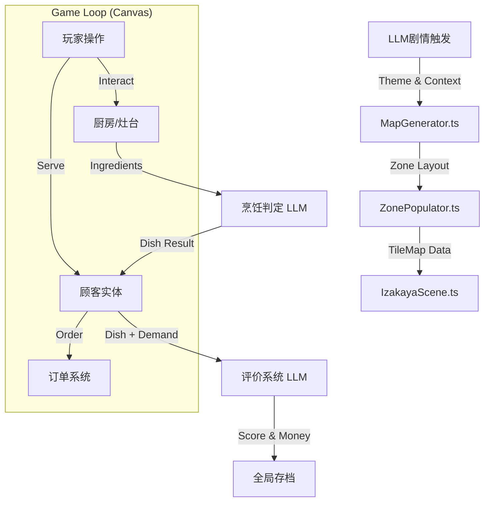

# 异世界居酒屋经营小游戏 (Izakaya Management Mini-game) 技术设计文档

> 最后更新时间: 2025-12-21
> 状态: Development Phase (Scene & Interaction Refinement)

## 1. 项目概述 (Overview)

本模块旨在构建一个深度集成的经营模拟小游戏，融合了 **像素风格 RPG 探索**、**LLM 驱动的叙事交互** 以及 **自由度极高的烹饪模拟**。玩家将在游戏中扮演居酒屋老板，通过生成并装修店铺、接待性格各异的幻想乡角色（NPC）、制作料理并获得评价，从而推进游戏剧情与经济循环。

该模块并非独立游戏，而是深度嵌入在主游戏循环（Game Loop）中的一个子系统，与现有的存档系统（GameStore）、角色状态（CharacterStore）和物品系统（Inventory）无缝互通。

---

## 2. 核心架构设计 (Core Architecture)

### 2.1 模块定位与集成

*   **入口触发 (Trigger)**：
    *   **LLM 剧情驱动**：主剧情 LLM (LLM #1) 在生成特定剧情节点时，通过返回 `<management_trigger>` JSON 指令来启动经营模式。
    *   **手动调试触发**：在设置面板中通过 "Trigger Management Game" 按钮强制启动（用于开发与测试）。
    *   **数据载荷**：触发时携带 `theme` (店铺主题), `context` (当前剧情上下文), `specialGuests` (预定到访的关键 NPC) 等参数。

*   **状态管理 (State Management)**：
    *   **数据存储**：所有经营状态存储于 `GameStore` 的 `system.management` 命名空间下，确保与战斗系统（Combat）隔离。
    *   **持久化**：经营结束时，收益（金钱）、消耗（食材）、NPC 好感度变化将合并回全局状态并触发自动保存。

    ```typescript
    // src/types/game.ts (示例结构)
    interface ManagementState {
        isActive: boolean;        // 经营模式是否激活
        isTriggered: boolean;     // 是否已触发初始化
        context: string;          // 剧情上下文
        difficulty: "easy" | "normal" | "hard";
        stats: {
            totalRevenue: number;
            customersServed: number;
            reputationGained: number;
            startTime: number;
        };
        customMap?: MapData;      // 当前生成的动态地图数据
    }
    ```

### 2.2 目录结构与职责

代码主要位于 `src/services/management/` 目录下，采用服务化架构：

*   **`MapGenerator.ts`**: 负责调用 LLM 生成店铺的区域布局（Zoning），处理 Prompt 工程。支持多楼层（Multi-floor）生成指令。
*   **`ZonePopulator.ts`**: 负责将抽象的区域布局（Zone Layout）转化为具体的瓦片地图（Tile Map）。
    *   **核心逻辑**：包括墙壁自动生成、连通性检查、家具智能摆放（避免死角）、楼梯连接逻辑。
*   **`IzakayaScene.ts`**: 核心渲染引擎，基于 HTML5 Canvas 实现网格移动、精灵渲染、粒子效果及交互事件循环。
*   **`CustomerService.ts`**: 管理顾客实体，包括生成、寻路（Pathfinding）、状态机（等待/点单/进食/评价）及 AI 对话交互。

---

## 3. 详细功能模块设计 (Detailed Design)

### 3.1 动态地图生成系统 (Dynamic Map Generation)

为了提供无限的重玩价值，居酒屋的布局并非固定，而是由 LLM 根据当前剧情主题实时生成。

1.  **生成阶段 (Generation)**:
    *   **输入**：`Theme` (如 "Cozy Wooden Izakaya"), `Context` (如 "Summer Festival").
    *   **LLM 处理**：`MapGenerator.ts` 构造 Prompt，请求 LLM 返回一个 20x15 的字符网格（ASCII Art），定义区域功能。
    *   **约束优化 (Constraint Optimization)**:
        *   **Zone Consolidation**: 强制生成大块连续区域，避免地图碎片化。
        *   **Wall Thickness**: 强制使用单层墙体（`#`），最大化空间。
        *   **Minimum Size**: 强制功能区（K, D, L, B）最小尺寸为 4x4。
    *   **区域符号**：
        *   `K`: 厨房 (Kitchen) - 员工区域
        *   `D`: 用餐区 (Dining) - 顾客区域
        *   `W`: 走廊 (Walkway) - 必须保持畅通
        *   `E`: 入口 (Entrance) - **强制位于底部墙壁**
        *   `S`: 楼梯 (Stairs) - **多层地图必需**

2.  **实例化阶段 (Population)**:
    *   **处理**：`ZonePopulator.ts` 解析字符网格。
    *   **智能填充逻辑**：
        *   **厨房布局优化 (Advanced Kitchen Logic)**：
            *   **Boundary Classification**: 自动识别“前台”（临接 Dining/Walkway）和“后台”（临接 Wall）。
            *   **Forced Bar Counter**: 在前台区域强制生成连续的吧台（`C`），并保留唯一入口。
            *   **Appliance Priority**: 将厨具（`O`, `S`, `B` x3）优先放置在后台区域，保持中间通道（Aisle）畅通。
        *   **入口强制约束**：若 LLM 生成的入口不在底部墙壁，系统会自动修正并绘制通往底部的路径，确保玩家和顾客能正常进出。
        *   **楼梯连接**：优先识别 LLM 生成的 `S` 区域；若缺失，则根据层级逻辑回退生成。
        *   **地板材质保护**: 确保特殊区域（如厨房）的地板材质不被意外重置。

### 3.2 场景与角色控制 (Scene & Entity)

*   **渲染技术**：
    *   采用 **Grid-based Movement** (逻辑上按格移动) + **Pixel-smooth Animation** (视觉上平滑插值)。
    *   支持多层渲染：`Background` (地板/墙), `Furniture` (家具/装饰), `Entities` (角色/物品), `Foreground` (遮挡物/UI).
    *   **特殊渲染**: 垂直玻璃墙体独立渲染逻辑，楼梯区域的特殊触发逻辑。
*   **交互逻辑**：
    *   **玩家控制**：WASD 移动，F 键交互。
    *   **交互检测**：Raycast 检测玩家朝向的一格内是否有可交互实体（顾客、灶台、大门）。
    *   **楼层切换**: 支持双向楼梯触发。
        *   **上楼 (Up)**: 撞击楼梯顶部墙壁或走出楼梯区域时触发。
        *   **下楼 (Down)**: 撞击楼梯底部墙壁或走出楼梯区域（Walking Off）时触发，确保交互流畅。

### 3.3 顾客 AI 系统 (Customer AI)

顾客不仅仅是移动的纹理，而是驱动经营循环的核心。

*   **生命周期 (Lifecycle)**:
    1.  **Spawn**: 在地图入口生成。
    2.  **Pathfind**: 寻找空闲的座位（Dining Zone）。
    3.  **Order**: 入座后，根据性格标签生成“点单对话”（如：“老板，来点下酒菜！”）。
    4.  **Wait**: 等待上菜，心情值随时间衰减。
    5.  **Eat**: 进食动画，触发味觉评价。
    6.  **Leave**: 结账并离店。
*   **寻路算法**: 使用 A* 或 BFS 算法在动态生成的网格地图上规划路径，动态避开障碍物。

### 3.4 自由烹饪与评价 (Cooking & Evaluation)

*   **烹饪流程**:
    1.  **交互**: 玩家在厨房区域与灶台交互，打开烹饪 UI。
    2.  **投入**: 玩家从背包中拖拽任意食材入锅（无固定配方）。
    3.  **判定**:
        *   系统记录投入的食材列表（如：辣椒 + 猪肉 + 豆腐）。
        *   调用 LLM 扮演“美食家”，根据食材组合推断菜名（如：“麻婆豆腐”）和口味标签（辣、咸、热）。
*   **评价结算**:
    *   **LLM 裁判**: 将“顾客需求”与“菜品属性”对比。
    *   **反馈**:
        *   **Score**: 0-100 分。
        *   **Comment**: 顾客的具体评价（如：“虽然很辣，但正合我意！”）。
        *   **Reward**: 获得金钱与好感度。

---

## 4. 数据流向图 (Data Flow)



---

## 5. 开发路线图 (Roadmap)

### Phase 1: 基础架构 (Infrastructure) - [已完成]
- [x] 建立 `src/services/management` 目录结构。
- [x] 实现 `MapGenerator` 与 `ZonePopulator` 原型，支持 LLM 生成动态地图。
- [x] 接入 `GameStore` 状态管理。
- [x] **优化地图生成算法**：修复楼梯缺失、厨房家具死角、入口位置偏移等随机编排问题。
- [x] **实现 LLM Prompt 约束优化**：Zone Consolidation, Wall Thickness, Min Size.

### Phase 2: 场景与交互 (Scene & Interaction) - [大部分完成]
- [x] 完善 `IzakayaScene.ts`，实现 Canvas 上的瓦片地图渲染 (含 Vertical Glass Wall)。
- [x] 实现玩家角色的 WASD 移动与碰撞检测。
- [x] 实现楼层切换系统 (Stairs Trigger Logic)。
- [ ] 实现基础的 UI 覆盖层（设置、结束经营）。

### Phase 3: 顾客循环 (Customer Loop) - [计划中]
- [ ] 实现 `CustomerService` 的寻路逻辑。
- [ ] 集成 LLM 生成顾客的点单对话。
- [ ] 实现订单管理 UI。

### Phase 4: 烹饪与经济 (Cooking & Economy) - [计划中]
- [ ] 开发烹饪界面，支持背包物品拖拽。
- [ ] 对接 LLM 进行菜品判定与评分。
- [ ] 完成金钱结算与好感度回写逻辑。

---

## 6. 注意事项与风险 (Notes & Risks)

1.  **Token 消耗控制**:
    *   地图生成仅在经营开始时调用一次。
    *   顾客对话应使用轻量级模型或缓存机制，避免每个路人 NPC 都消耗大量 Token。
    *   烹饪判定可考虑在前端做简单的规则预判，仅在复杂组合时调用 LLM。

2.  **性能优化**:
    *   Canvas 渲染需注意帧率优化，避免在渲染循环中进行复杂的对象创建或垃圾回收。
    *   寻路算法应在 Web Worker 或分帧处理，防止阻塞主线程 UI。

3.  **错误处理**:
    *   LLM 生成的地图可能偶尔不连通，需在 `ZonePopulator` 中加入连通性检查（Flood Fill），若失败则回退到备用地图模板。
    *   **随机生成鲁棒性**：已加入对“孤立家具”和“封闭区域”的检测逻辑，确保生成的地图始终可玩。
